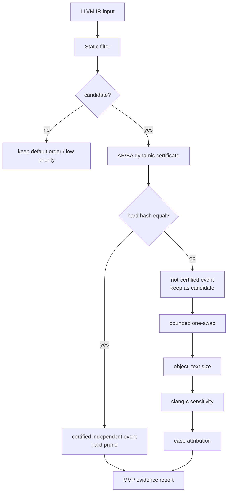

# ECPOR

ECPOR 是一个 evidence-carrying LLVM phase-ordering reduction 原型，不是完整 pass-order searcher。它用 state-indexed 的 AB/BA 相邻 pass 证书证明哪些顺序可以折叠，用静态过滤降低候选量，并把 order-sensitive 的候选保留下来继续做 bounded local validation 与 `.text` 目标层检查。

当前主入口报告见 [docs/ecpor_mvp_report.md](docs/ecpor_mvp_report.md)；P9-6 阶段报告见 [docs/ecpor_stage_report.md](docs/ecpor_stage_report.md)；阶段进度索引见 [docs/project_progress.md](docs/project_progress.md)。

P10 已把 `configs/passspec.yaml` 升级为兼容旧 list schema 与新 provenance metadata 的 PassSpec v2：静态过滤行为不变，但经验性 repair hint 现在带有 `source`、`confidence`、`support` 与 `created_in_stage`。审计结果见 [docs/results/passspec_audit_manifest.json](docs/results/passspec_audit_manifest.json)。

## 当前 MVP 范围

当前 MVP 只覆盖 LLVM IR scalar pass 的相邻顺序约简：

- 输入集合：Stanford-8 与 Misc8，共 `16` 个程序。
- 证书层：每个 benchmark set 运行 `8 * 28 = 224` 个 unordered pass-pair certificate。
- 静态层：`passspec.yaml` 驱动 high-recall candidate / low_priority 分类。
- 动态层：对当前 state 的 AB/BA pipeline 做 hard hash 证书判断。
- 目标层：只检查 object `.text` size，并用 `llc` 与 `clang -c` 做 codegen sensitivity 对照。
- 归因层：只对已观察到的 both-smaller case 做 case-level attribution；这是 observed attribution，不是因果证明。

## P9-1 核心结果

| 结论 | 当前结果 |
| --- | ---: |
| benchmark sets | 2 |
| programs | 16 |
| pair certificates | 448 |
| reproduced certificates | 448 / 448 |
| HardFalseIndependent | 0 |
| StaticFalseNegativeObserved after repair | 0 on Stanford-8 and Misc8 |
| one-swap candidates | 32 |
| `.text` smaller one-swap candidates | 2 programs, 1 per set |
| IR-different but `.text` equal one-swap candidates | 30 |
| attribution cases | 2: Queens and ffbench |

解释：证书层当前没有发现 hard false independent；静态过滤修复后在两个 benchmark set 上没有观察到 false negative；多数 IR 差异不会传导到 `.text`，只有 `testsuite_stanford_queens` 与 `testsuite_misc_ffbench` 出现 both-codegen-smaller case，并已进入可复查归因。

## Post-MVP P9-5 depth1 扩展

P9-5 不改变 `v0.1.1` MVP 语义。`v0.1.1` 仍然定义为 Stanford-8 + Misc8，共 `16` 个程序、`448` 个 pair certificate。P9-5 只是把已经完成的 Diverse8 depth1-only 证据并入一个 post-MVP 总表，用来确认扩展到 `24` 个程序后主结论是否稳定。

| 指标 | P9-5 结果 |
| --- | ---: |
| benchmark sets | 3 |
| programs | 24 |
| pair certificates | 672 |
| reproduced certificates | 672 / 672 |
| HardFalseIndependent | 0 |
| adjacent validation attempts | 168 |
| certified adjacent events | 101 |
| not-certified adjacent events | 39 |
| one-swap candidates | 39 |
| depth1 both-smaller programs | 2 |
| Diverse8 both-smaller programs | 0 |

解释：Diverse8 增加了覆盖面，但没有新增 depth1 both-smaller program。因此当前阶段不建议继续搜索；P10 已完成 PassSpec provenance v2，后续更合适的是写 PassSpec trust report / paper-facing methods note。

## Evidence Level

| evidence level | 含义 | 可作为 hard prune |
| --- | --- | --- |
| `certified_independent_event` | 当前 state 下 AB/BA hard hash 相同，且 certificate 可复现 | yes |
| `not_certified_event` | 当前 state 下 AB/BA hard hash 不同 | no |
| `low_priority` | 静态过滤认为优先级低，但未动态证明 | no |
| `sequence_duplicate` | 不同 swap 路径生成同一 sequence，可去重 | no |
| `llc/clang both-smaller` | `.text` 在两条 codegen path 下都变小 | no |
| `attribution` | 对单个 observed case 的 feature/opcode/object 归因 | no |

## MVP 流程



## 复现 P9-1 MVP Summary

使用 dlm Python 环境：

```powershell
$env:PYTHONPATH = "src"
D:\Miniconda\envs\dlm\python.exe -m pytest -q
```

期望测试结果：

```text
107 passed
```

外部 clone 后可以直接阅读这些已跟踪文件来理解冻结结果：

- [docs/ecpor_mvp_report.md](docs/ecpor_mvp_report.md)
- [docs/results/mvp_summary_manifest.json](docs/results/mvp_summary_manifest.json)
- [docs/project_progress.md](docs/project_progress.md)

`data/outputs/` 按 data retention 规则不纳入 Git 跟踪；因此 fresh clone 默认不能直接重生成 P9-1 summary。下面的命令需要当前工作区保留已有 P4/P5/P6/P8/P9 输出，或先按历史阶段重新生成这些输入。若输入文件缺失，`ecpor.mvp_summary` 会返回非零并列出缺失文件，避免生成误导性的全 0 summary。

在带有 retained result inputs 的工作区中重新生成 MVP summary：

```powershell
$env:PYTHONPATH = "src"
D:\Miniconda\envs\dlm\python.exe -m ecpor.mvp_summary `
  --out data\outputs\final_mvp_summary `
  --manifest docs\results\mvp_summary_manifest.json
```

期望核心值：

```text
BenchmarkSets=2
TotalPrograms=16
TotalPairMatrixCertificates=448
TotalReproducedCertificates=448
TotalHardFalseIndependent=0
TotalBothSmallerPrograms=2
AttributionCases=2
```

## 当前支持

- Windows + PowerShell workflow。
- 本地 LLVM 工具链：`E:\llvm\build\bin`。
- benchmark root：`E:\llvm-test-suite`。
- Stanford-8 与 Misc8 的 certificate matrix、static filter evaluation、lazy validation、bounded one-swap、code-size sensitivity、case attribution。
- 结果 manifest 与 data retention 规则；`data/` 只保留必须保留的可复查产物。

## 当前不支持

- 完整 phase-ordering searcher。
- depth=3、beam search、RL、MCTS。
- loop pass、module pass、inline pipeline。
- runtime benchmark。
- Alive2 / formal equivalence proof。
- LLVM PassInstrumentation tracing。
- 自动完整 PassSpecDB。
- “击败 O2/O3” 这类大范围性能宣称。

## 目录结构

| 路径 | 作用 |
| --- | --- |
| `src/ecpor/` | runner、certificate、filter、bounded validation、summary/report 代码 |
| `configs/` | scalar pipeline、passspec、benchmark ingest 配置 |
| `data/inputs/` | 保留的 LLVM IR 输入 |
| `data/outputs/final_mvp_summary/` | P9-1 MVP summary 输出 |
| `data/outputs/combined_depth1_summary/` | P9-5 post-MVP 24-program depth1 summary 输出 |
| `docs/ecpor_stage_report.md` | P9-6 阶段报告 / 论文草稿入口 |
| `docs/results/` | 可提交 manifest |
| `docs/progress/` | 按顺序拆分的中文进度记录 |
| `docs/data_retention_manifest.md` | `data/` 保留规则 |
| `tests/` | 单元测试与回归测试 |

## 下一步

P10 之后优先做 P10.5 PassSpec trust report / paper-facing methods note，把 5 条 empirical repair hint 的来源、support 与仍为 legacy 的 59 条 hint 解释清楚。当前不建议继续 two-swap、depth=3、beam/searcher、runtime benchmark 或 Alive2。
