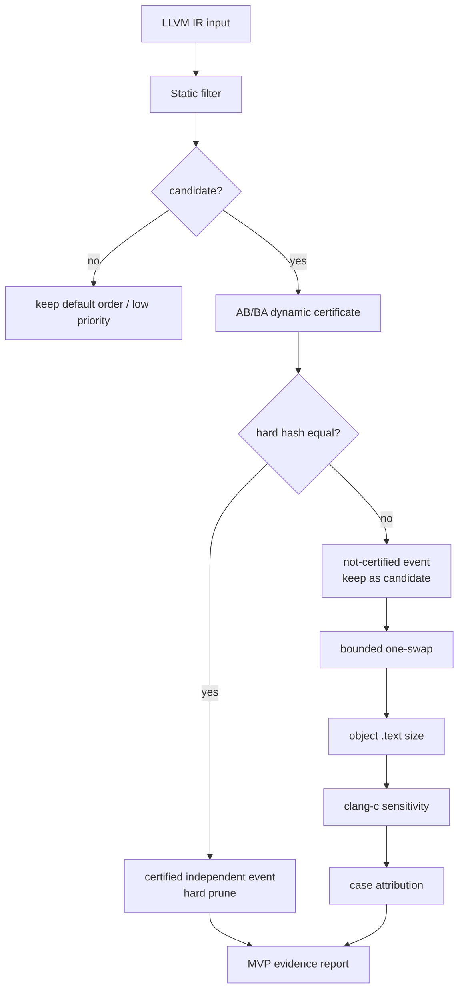

# ECPOR MVP 主报告

## 一句话概括

ECPOR 是一个 evidence-carrying LLVM phase-ordering reduction 原型：它不直接声称找到全局最优 pass 顺序，而是用 state-indexed AB/BA certificate 证明哪些相邻 pass 顺序可以安全折叠，并保留真正 order-sensitive 的候选继续验证。

## 当前 MVP 问题边界

当前阶段回答的是一个更窄但可复查的问题：

```text
在给定 LLVM IR state、给定 scalar pass 集合和给定相邻 pass pair 下，
哪些顺序可以用 hard hash certificate 证明等价，从而不用继续搜索？
哪些顺序不能证明等价，需要保留为候选？
少数候选在 object .text 上是否真的产生目标层差异？
```

因此本项目当前不是：

- 完整 phase-ordering searcher。
- O2/O3 替代品。
- runtime optimizer。
- formal equivalence prover。

它当前是一个用于减少 phase-ordering 搜索空间、记录证据、解释候选传播路径的 MVP。

## P9-1 总结果

P9-1 只汇总已有 Stanford-8 与 Misc8 结果；没有新增搜索、没有新增 certificate、没有运行新的 LLVM pipeline 或 runtime benchmark。

| 指标 | 数值 | 含义 |
| --- | ---: | --- |
| BenchmarkSets | 2 | Stanford-8 与 Misc8 |
| TotalPrograms | 16 | 两组各 8 个程序 |
| TotalPairMatrixCertificates | 448 | `2 * 8 * 28` 个 unordered pass-pair certificate |
| TotalReproducedCertificates | 448 | 全部证书可复现 |
| TotalHardFalseIndependent | 0 | 未观察到 hard hash 证明后又被 reproduction 推翻的情况 |
| TotalAdjacentAttempts | 112 | P4/P8b-3-lite 相邻 swap validation 尝试数 |
| TotalCertifiedEvents | 64 | 相邻 validation 中可 hard prune 的事件数 |
| TotalNotCertifiedEvents | 32 | 必须保留为候选的事件数 |
| TotalOneSwapCandidates | 32 | 两组各 16 个 one-swap candidate |
| TotalBothSmallerPrograms | 2 | Stanford Queens 与 Misc ffbench |
| AttributionCases | 2 | 两个 both-smaller program 均有 case-level attribution |

## Post-MVP P9-5 depth1 扩展

P9-5 是 post-MVP summary-only 扩展，不改变 `v0.1.1` MVP 发布边界。`v0.1.1` MVP 仍然是 Stanford-8 + Misc8，共 `16` 个程序、`448` 个 pair certificate；P9-5 只把已经完成的 Diverse8 depth1-only 证据合并进同一张总表。

| 指标 | P9-5 结果 | 含义 |
| --- | ---: | --- |
| BenchmarkSets | 3 | Stanford-8、Misc8、Diverse8 |
| TotalPrograms | 24 | 三组各 8 个程序 |
| TotalPairMatrixCertificates | 672 | `3 * 8 * 28` 个 unordered pass-pair certificate |
| TotalReproducedCertificates | 672 | 全部证书可复现 |
| TotalHardFalseIndependent | 0 | 扩展到 24 程序后仍未观察到 hard false independent |
| TotalAdjacentAttempts | 168 | 三组 depth1 adjacent validation 尝试数 |
| CertifiedAdjacentEvents | 101 | 可作为当前 state hard-prune evidence 的事件 |
| NotCertifiedAdjacentEvents | 39 | 必须保留为 one-swap 候选的事件 |
| TotalOneSwapCandidates | 39 | depth1-only 候选数 |
| TotalBothSmallerPrograms | 2 | 仍然只有 Queens 与 ffbench |
| Diverse8BothSmallerPrograms | 0 | Diverse8 没有新增 both-smaller program |

P9-5 的结论是：Diverse8 增加了 benchmark 覆盖面，但没有扩大 both-smaller program 集合。因此当前更适合进入总结合并和写作阶段，而不是继续加深搜索。

## Benchmark Set Summary

| benchmark | programs | pair certs | reproduced | hard false | static FN | adjacent attempts | certified | not certified | one-swap | both-smaller programs |
| --- | ---: | ---: | ---: | ---: | ---: | ---: | ---: | ---: | ---: | ---: |
| Stanford-8 | 8 | 224 | 224 | 0 | 0 | 56 | 32 | 16 | 16 | 1 |
| Misc8 | 8 | 224 | 224 | 0 | 0 | 56 | 32 | 16 | 16 | 1 |

这张表说明两个 benchmark set 的证书链条和 lazy validation 链条都跑通了。`hard false = 0` 是当前最重要的安全信号；`static FN = 0` 表示修复后的静态过滤在已观察样本上没有漏掉 not-certified pair。

## Reduction Summary

| benchmark | certified | not certified | reproduction | static recall | pruning ratio attempted |
| --- | ---: | ---: | ---: | ---: | ---: |
| Stanford-8 | 144 | 80 | 100.00% | 100.00% | 57.14% |
| Misc8 | 148 | 76 | 100.00% | 100.00% | 57.14% |

这张表来自完整 pair matrix 与相邻 validation 的汇总。`certified` 表示 AB/BA hard hash 相同，可以作为当前 state 下的 hard prune evidence；`not certified` 表示 AB/BA hard hash 不同，必须继续保留。`pruning ratio attempted` 只描述已尝试相邻 swap 中被证书剪掉的比例，不代表全局搜索空间剪枝率。

## Objective Summary

| benchmark | object evaluated | smaller | equal | larger | IR-different text-equal | direction agreement | both-smaller cases |
| --- | ---: | ---: | ---: | ---: | ---: | ---: | ---: |
| Stanford-8 | 16 | 1 | 15 | 0 | 15 | 68.42% | 4 |
| Misc8 | 16 | 1 | 15 | 0 | 15 | 93.75% | 1 |

这张表说明：IR hard hash 不同并不等于目标代码一定变化。两组各有 16 个 one-swap candidate，其中各 15 个是 IR 不同但 `.text` 相等。只有 Queens 与 ffbench 这两个程序在 `llc` 与 `clang -c` 下都观察到 `.text` 变小。

## Attribution Cases

| benchmark | program | pair | opcode delta | llc pct | clang pct | evidence |
| --- | --- | --- | --- | ---: | ---: | --- |
| Stanford-8 | `testsuite_stanford_queens` | `simplifycfg,instcombine` | `num_icmp_delta=-1;num_select_delta=-1;num_add_delta=1` | -4.401651 | -1.673640 | observed attribution, not causal proof |
| Misc8 | `testsuite_misc_ffbench` | `instcombine,simplifycfg` | `num_select_delta=-1;num_or_delta=1` | -1.005025 | -0.127280 | observed attribution, not causal proof |

归因表只说明“这个 case 的局部顺序差异、opcode delta 与 object size delta 同时被观察到”。它不是因果证明，也不是跨程序规律；它的价值是把一个 larger search result 压缩成可复查的单状态案例。

## Evidence Level

| evidence level | 产生位置 | 含义 | 可作为 hard prune |
| --- | --- | --- | --- |
| `certified_independent_event` | AB/BA certificate | 当前 state 下 AB/BA hard hash 相同，certificate 可复现 | yes |
| `not_certified_event` | AB/BA certificate | 当前 state 下 AB/BA hard hash 不同 | no |
| `low_priority` | static filter | 静态规则认为低优先级，但没有动态证明 | no |
| `sequence_duplicate` | bounded local driver | 不同 swap 路径生成同一 pass sequence | no |
| `llc/clang both-smaller` | code-size layer | `.text` 在两条 codegen path 下都变小 | no |
| `attribution` | effect attribution | 单个 observed case 的 feature/opcode/object 解释 | no |

只有 `certified_independent_event` 可以作为 hard prune。其他 evidence level 都只能用于排序、解释、去重或后续人工复查。

## 主流程



## 复现命令

先运行单元测试：

```powershell
$env:PYTHONPATH = "src"
D:\Miniconda\envs\dlm\python.exe -m pytest -q
```

期望结果：

```text
107 passed
```

外部 fresh clone 可以直接检查 README、本报告和 `docs/results/mvp_summary_manifest.json`，不需要本地 LLVM 或历史 `data/outputs`。这些 tracked 文档已经包含 P9-1 的冻结指标和 scope limits。

完整重生成 P9-1 MVP summary 需要当前工作区保留已有 P4/P5/P6/P8/P9 输出，因为 `data/outputs/` 按 data retention 规则不纳入 Git 跟踪。如果缺少这些输入，`ecpor.mvp_summary` 会返回非零并列出缺失文件，而不是生成全 0 summary。

在带有 retained result inputs 的工作区中重新生成 P9-1 MVP summary：

```powershell
$env:PYTHONPATH = "src"
D:\Miniconda\envs\dlm\python.exe -m ecpor.mvp_summary `
  --out data\outputs\final_mvp_summary `
  --manifest docs\results\mvp_summary_manifest.json
```

关键结果应保持：

```text
BenchmarkSets=2
TotalPrograms=16
TotalPairMatrixCertificates=448
TotalReproducedCertificates=448
TotalHardFalseIndependent=0
TotalBothSmallerPrograms=2
AttributionCases=2
```

## 主要文件

| 文件或目录 | 说明 |
| --- | --- |
| [README.md](../README.md) | 五分钟项目入口 |
| [docs/ecpor_stage_report.md](ecpor_stage_report.md) | P9-6 阶段报告 / 论文草稿入口 |
| `data/outputs/final_mvp_summary/mvp_summary_report.md` | 自动生成的 P9-1 summary；保留在本地 result workspace，不纳入 Git |
| `data/outputs/combined_depth1_summary/combined_depth1_report.md` | 自动生成的 P9-5 post-MVP depth1 总表；保留在本地 result workspace，不纳入 Git |
| [docs/results/mvp_summary_manifest.json](results/mvp_summary_manifest.json) | P9-1 result manifest |
| [docs/results/combined_depth1_summary_manifest.json](results/combined_depth1_summary_manifest.json) | P9-5 post-MVP result manifest |
| [docs/results/stage_report_manifest.json](results/stage_report_manifest.json) | P9-6 stage report manifest |
| [docs/results/core_evidence_manifest.json](results/core_evidence_manifest.json) | Stanford core evidence manifest |
| [docs/results/core_evidence_misc8_manifest.json](results/core_evidence_misc8_manifest.json) | Misc8 evidence supplement manifest |
| [docs/data_retention_manifest.md](data_retention_manifest.md) | `data/` 保留规则 |
| [docs/project_progress.md](project_progress.md) | 阶段进度索引 |

## 当前不支持的范围

- 完整 phase-ordering search。
- depth=3、beam search、RL、MCTS。
- loop pass、module pass、inline。
- runtime benchmark。
- Alive2 / formal equivalence。
- PassInstrumentation。
- 自动完整 PassSpecDB。
- 与 O2/O3 的端到端性能优劣宣称。

## 下一步

P9-6 完成后，优先进入 P10 PassSpec provenance v2。当前不建议继续 two-swap、depth=3、beam/searcher、runtime benchmark、Alive2 或 PassInstrumentation。
